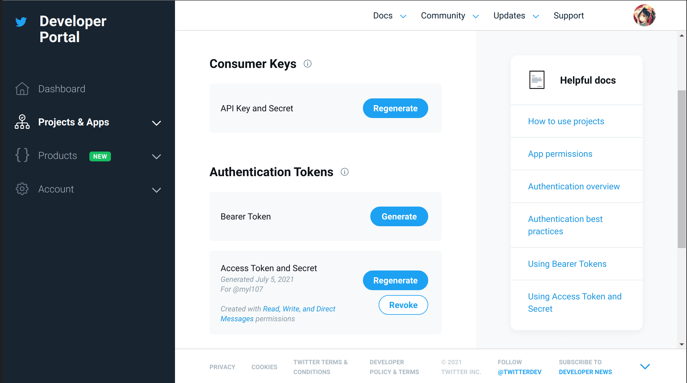

# tgchan2tw

Automatically forward Telegram channel posts to Twitter

Used by myself for [@myl7s](https://t.me/myl7s) on Telegram -> [@myl107](https://twitter.com/myl107) on Twitter

## Features

Support images: Embed them into Twitter status

Support replies: When you reply on Telegram, 
corresponding status will also reply to corresponding status if exists on Twitter

Support forward message: Other than stubbornly copy the message body,
use the original link as body to send to Twitter.

Merge forward message and your comment: If you forward a message with your some words,
Telegram will, surprisingly, create two messages, of which one contains the forward message,
and the other contains your words.
The app will merge the two into only one status and send it to Twitter.

Split status if reaching Twitter length limit: While Telegram generously allow you to send so long message,
Twitter status length limit is kinda annoying.
The app will handle this, automatically and properly split a Telegram message into several Twitter statuses
to fit the Twitter requirement. 

Feel free to raise new feature request using "Issue" panel!

## Deploy

The app requires a RSSHub server to get structural Telegram channel posts.
The default https://rsshub.app provided by RSSHub official actually cannot work with Telegram.
So you should deploy a RSSHub on your own.
See [RSSHub docs about it](https://docs.rsshub.app/install/) for detailed steps
(You can also find how to "freely" deploy RSSHub like using Heroku or Vercel there).

Then use Docker image `myl7/tgchan2tw`: 

```bash
docker run -d --restart=always --name tgchan2tw \
  -v ...:/db \
  -e RSSHUB_HOST=... \
  -e TG_CHAN_NAME=... \
  -e TW_CONSUMER_KEY=... \
  -e TW_CONSUMER_SECRET=... \
  -e TW_TOKEN_KEY=... \
  -e TW_TOKEN_SECRET=... \
  myl7/tgchan2tw:1
```

All data, stored in a SQLite database, are in `/db/db.sqlite` by default.
Mount it to somewhere to persistent the data.

Use env to configure app options. 
Dotenv is also OK by putting `.env` file into `/app`.

## Options

All available options and their default value if exists can be found in [`pkg/conf/options.go`](https://github.com/myl7/tgchan2tw/blob/goshujin-sama/pkg/conf/options.go)

## Twitter secrets

To get the required Twitter secrets, go to [Twitter Developer Platform](https://developer.twitter.com)
to login into Developer Portal.
You can get "Consumer Keys" and "Authentication Tokens" like:



Here I "Created with Read, Write, and Direct Messages permissions".
Selecting only "Read and Write" should be fine too.

## License

MIT
